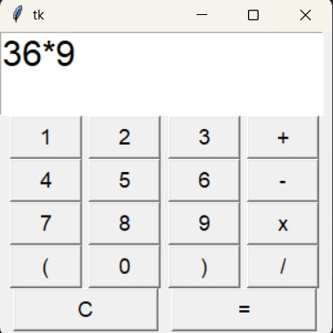

# SIMPLE GUI CALCULATOR



A simple and user-friendly graphical user interface (GUI) calculator built with Python using Tkinter.

---

## ✨ Features
- Basic arithmetic operations: addition, subtraction, multiplication, and division.
- Clear button to reset the input.

---

## 🛠 Requirements
- Python 3
- Tkinter (usually comes pre-installed with Python)

---

## 🚀 Installation
1. Clone the repository or download the source code.
2. Ensure you have Python 3 installed on your machine.
3. If Tkinter is not installed, install it with:
   ```bash
   pip install tk
